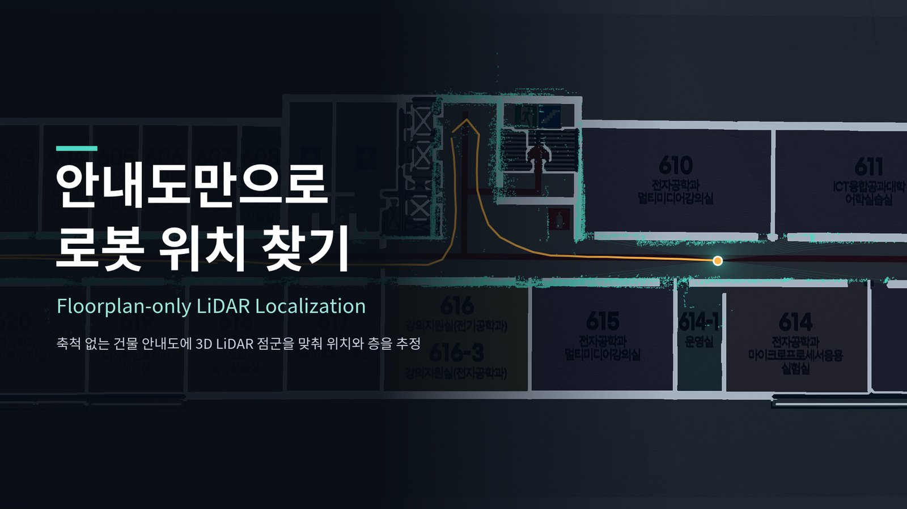
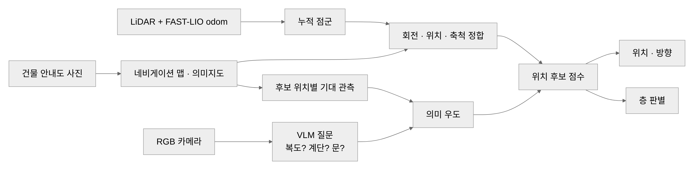
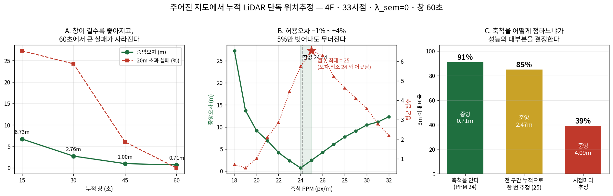
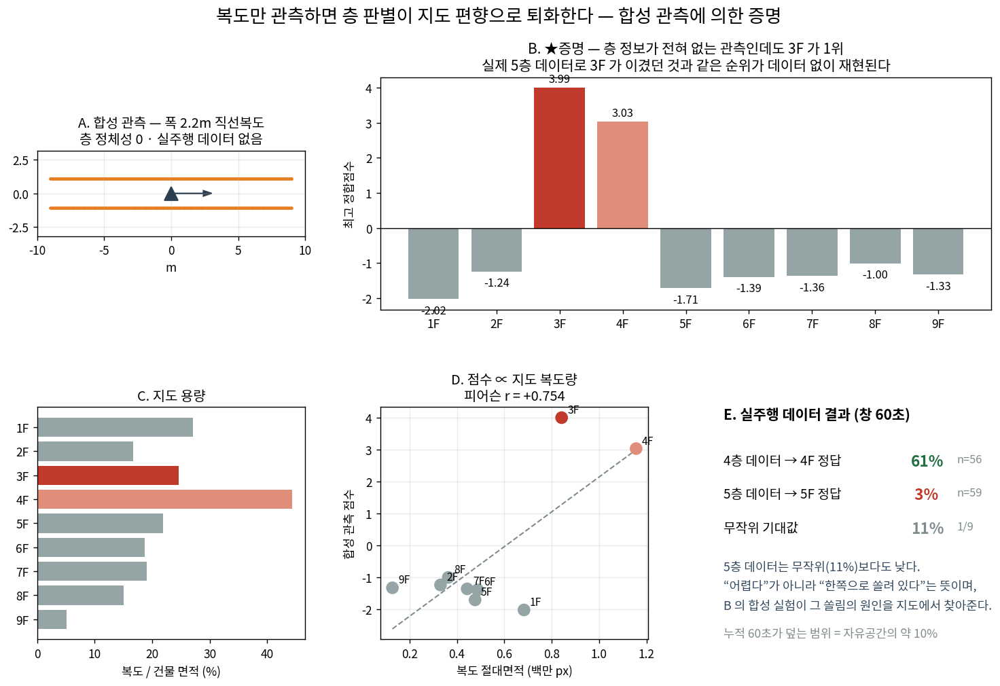

# Floorplan-Localization

건물 **안내도 사진만으로** 4족 보행 로봇(Unitree Go2)의 위치와 층을 찾는 연구입니다.
CAD 도면이나 미리 만든 LiDAR 지도 없이, 안내도에서 만든 2D 지도에 누적 LiDAR 점군과 카메라 의미 정보를 맞춰 **위치 · 방향 · 축척 · 층**을 추정합니다.

> 진행 중인 연구라 **일부 모듈만** 공개합니다. 위치추정 본체와 주행 데이터는 포함하지 않았습니다.

## 파이프라인

지도 생성은 [Floorplan-SemanticMap](https://github.com/Wjs-SH/Floorplan-SemanticMap)에서 다룹니다.

## 결과

### 4층: 누적 LiDAR 단독 위치추정

- **설정:** 층을 알려준 상태, 4층 33시점, 누적 창 60초, 의미 정보 미사용
- **축척을 알 때:** 중앙 오차 **0.71 m**, 3 m 이내 **91%**
- **축척까지 추정할 때:** 중앙 오차 1.05 m, 3 m 이내 94%
- **축척이 핵심:** 허용 범위가 −1% ~ +4%로 좁아서, 5%만 벗어나도 성능이 무너집니다.

### 4층: 실시간 위치추정 (LiDAR + VLM)

- **설정:** 미래 데이터 없이 직전 30초만 사용, 시동 15초에 방향 확정, 의미 가중 λ=0.5
- **결과:** held-out 5지점 중앙 오차 **0.74 m**, 3 m 이내 **4/5**
- **의미 정보:** 카메라 이미지에 질문해 얻은 확률(빨강)을 지도에서 계산한 기대값(파랑)과 비교합니다.

### 다른 층: 누적 LiDAR와 안내도 정합

60초 동안 누적한 점군을 안내도에 맞춰 회전·위치·축척을 함께 추정합니다. 6층 세 시점에서 점의 56~81%가 안내도 벽 10 cm 안에 놓입니다.

### 층 판별: 복도만 보면 층을 가릴 수 없다

- **실험:** 층 정보가 전혀 없는 **합성 직선 복도**를 9개 층 지도와 겨루게 했습니다.
- **결과:** 실제 데이터가 없는데도 3층이 1위(점수 3.99)입니다. 판정이 관측이 아니라 **지도에 복도가 얼마나 많은지**에 끌린다는 뜻입니다.
- **대응 (진행 중):** 관측이 설명하지 못하는 지도 벽까지 벌점을 주는 양방향 정합과, 해치·메워진 면 같은 가짜 벽 제거를 넣고 있습니다.

## 공개한 코드

| 파일 | 내용 |
|---|---|
| [`src/vlm_scene.py`](src/vlm_scene.py) | Qwen3-VL-2B에 yes/no 질문 17개(복도·계단·문·엘리베이터 등)를 던져 0~1 관측 확률로 변환 |
| [`src/semantic_map.py`](src/semantic_map.py) | 의미지도에서 후보 위치·방향마다 "보여야 할 것"의 기대값 계산 (시야각·가시선·거리) |
| [`src/twoway.py`](src/twoway.py) | 관측→벽, 벽→관측 양방향 섹터 잔차 점수 |
| [`src/wall_clean.py`](src/wall_clean.py) | 해치·메워진 면 같은 가짜 벽 제거 (임계값은 그 지도 벽 두께의 배수) |

## 환경

- **로봇·센서:** Unitree Go2, Hesai XT16, RealSense D435i
- **소프트웨어:** Ubuntu 22.04, ROS 2 Humble, Python 3.10 (NumPy, SciPy, PyTorch, Transformers)
- **오도메트리:** [Wjs-FAST_LIO](https://github.com/Wjs-SH/Wjs-FAST_LIO)
